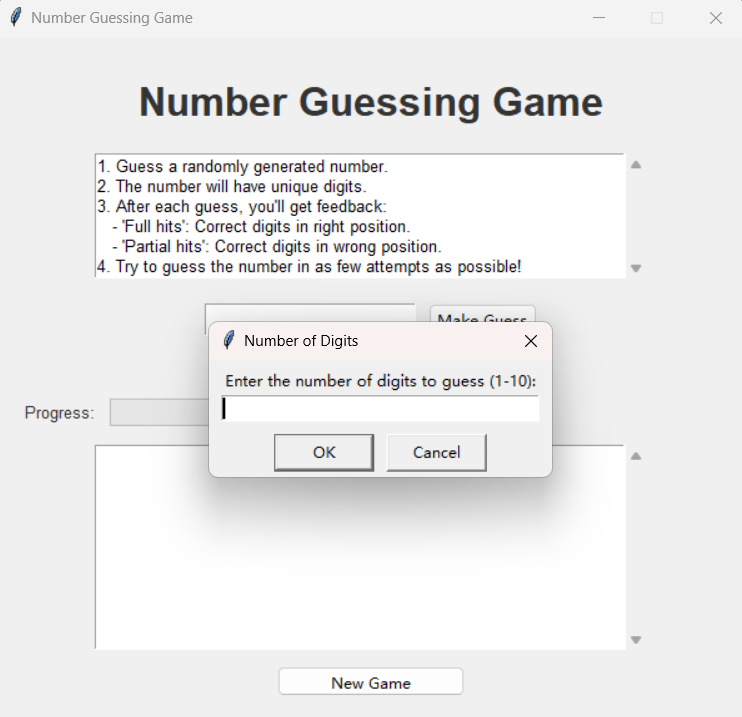
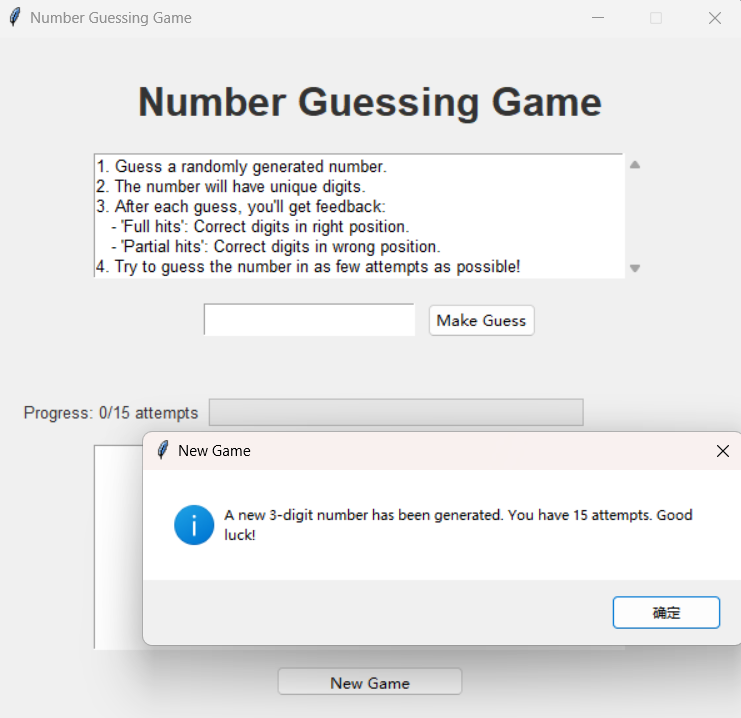
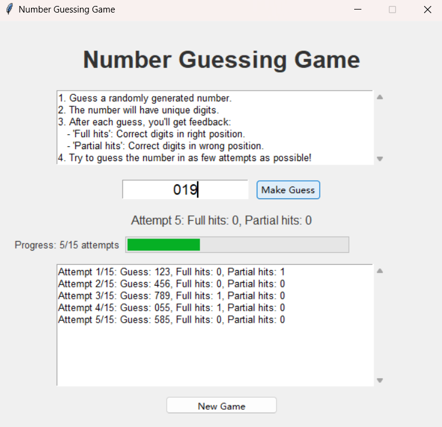
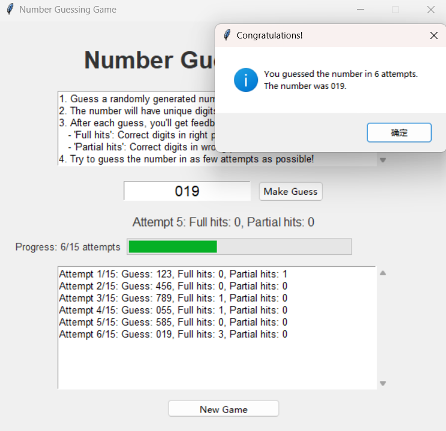

# Number Guessing Game

   A simple yet engaging Number Guessing Game with a graphical user interface built using Python and Tkinter.

## Features

- Guess a randomly generated number with unique digits
- Customizable number of digits (1-10)
- Visual feedback with full and partial hits
- Progress tracking with a progress bar
- Attempt log for reviewing previous guesses
- Maximum attempts based on the number of digits

## Requirements

- Python 3.x
- Tkinter (usually comes pre-installed with Python)

## Installation

1. Clone this repository:
   ```
   git clone https://github.com/NIC397/number-guessing-game.git
   ```
2. Navigate to the project directory:
   ```
   cd number-guessing-game
   ```

## Usage

   Run the game by executing the following command in the terminal:

```
   python src/main.py
```

   Follow the on-screen instructions to play the game.

## How to Play

1. When prompted, enter the number of digits you want to guess (1-10).
2. The game will generate a random number with unique digits.
3. Enter your guess in the input box and click "Make Guess" or press Enter.
4. You'll receive feedback on your guess:
   - Full hits: Correct digits in the correct position
   - Partial hits: Correct digits in the wrong position
5. Keep guessing until you find the correct number or reach the maximum attempts.
6. Start a new game by clicking the "New Game" button.

## Screenshots

   

## Contributing

   Contributions are welcome! Please feel free to submit a Pull Request.

## License

   This project is licensed under the MIT License - see the [LICENSE](LICENSE) file for details.
